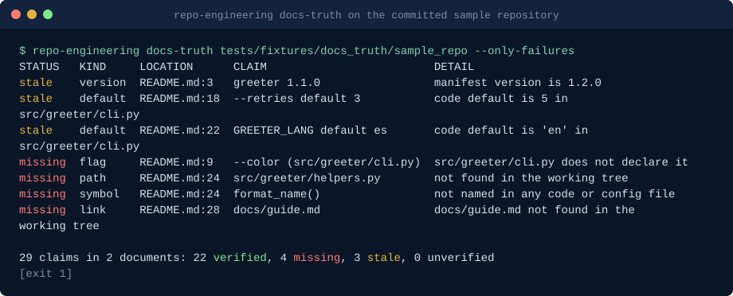

# repo-engineering-skills: Claude Code skills for repository audits and documentation

**Repository engineering skills for Claude Code: docs checked against the code, audits where every finding cites a line, onboarding guides built from cited facts, and restructure, ADR, hygiene and release checks run by scripts.**

repo-engineering-skills is a Claude Code plugin with ten skills for maintainers and teams who need to trust what is written about their repository: the README, the docs, the onboarding guide, the audit report, the AGENTS.md, the decision records, the release notes. It exists because generated docs and audits are cheap to produce and hard to check, so each skill pairs the model's work with a standard-library Python script that checks it against the working tree or the git history, instead of asking you to take the text on faith.

```text
/plugin marketplace add basitalisandhu/repo-engineering-skills
/plugin install repo-engineering@repo-engineering-skills
```

Quickstart: open Claude Code in a repository and ask "check the docs against the code", or run a script directly from a clone of this repository:

```bash
python3 plugins/repo-engineering/skills/docs-truth-check/scripts/docs_truth_check.py . --only-failures
```

Questions, bugs and ideas: open an issue on this repository. Security reports: see [SECURITY.md](SECURITY.md).

## Demo



Generated from the committed fixtures by [`scripts/render_demo.py`](scripts/render_demo.py); run `python3 scripts/render_demo.py` to regenerate it.

## Install

The plugin installs as shown above. The skill scripts are also published as one container image on GitHub Packages (linux/amd64 and linux/arm64) for running them without a checkout, for example in CI. The image's entrypoint is `repo-engineering <subcommand> [args]`; mount the files to read at `/work`, which is the working directory:

```bash
docker run --rm -v "$PWD:/work" ghcr.io/basitalisandhu/repo-engineering-skills:0.3.0 docs-truth /work --only-failures
docker run --rm -v "$PWD:/work" ghcr.io/basitalisandhu/repo-engineering-skills:0.3.0 readme-check /work/README.md
docker run --rm -v "$PWD:/work" ghcr.io/basitalisandhu/repo-engineering-skills:0.3.0 test-gaps /work --top 20
docker run --rm -v "$PWD:/work" ghcr.io/basitalisandhu/repo-engineering-skills:0.3.0 hygiene /work --sarif /work/hygiene.sarif
docker run --rm ghcr.io/basitalisandhu/repo-engineering-skills:0.3.0 --help
```

| Subcommand | Script (skill) |
|---|---|
| `docs-truth` | `docs_truth_check.py` (docs-truth-check) |
| `repo-facts` | `repo_facts.py` (cited-codebase-audit) |
| `audit-validate` | `audit_validate.py` (cited-codebase-audit) |
| `context-lint` | `context_lint.py` (agent-context-writer) |
| `readme-check` | `readme_check.py` (readme-who-what-why) |
| `test-gaps` | `test_gaps.py` (untested-entry-points) |
| `onboarding` | `onboarding_facts.py` (repo-onboarding-guide) |
| `onboarding-lint` | `onboarding_lint.py` (repo-onboarding-guide) |
| `restructure` | `restructure_plan.py` (restructure-planner) |
| `adr` | `adr_mine.py` (adr-miner) |
| `adr-lint` | `adr_lint.py` (adr-miner) |
| `hygiene` | `hygiene.py` (repo-hygiene-bundle) |
| `release-notes` | `release_notes_verify.py` (release-notes-verifier) |

Every subcommand passes its arguments to the script unchanged, so `repo-engineering <subcommand> --help` shows the same options as the script. Output files land in the mounted folder. The image has no pip dependencies, includes git for `adr` and `release-notes` (it trusts the `/work` mount as a git safe directory), and runs as uid 1000; on Linux, if the mounted folder is not writable by that uid, run the container as your own uid and gid with Docker's user option. From a checkout, `python3 scripts/cli.py` is the same dispatcher.

Each image is signed with cosign (keyless) and has a build provenance attestation and an SPDX SBOM (attached to the GitHub Release). To verify:

```bash
cosign verify ghcr.io/basitalisandhu/repo-engineering-skills:0.3.0 \
  --certificate-identity-regexp '^https://github.com/basitalisandhu/repo-engineering-skills/' \
  --certificate-oidc-issuer https://token.actions.githubusercontent.com
gh attestation verify oci://ghcr.io/basitalisandhu/repo-engineering-skills:0.3.0 --owner basitalisandhu
```

## When to use this

- Is the README still true after a rename, a removed flag or a changed default? `docs-truth-check`
- Audit a codebase so that every finding can be opened and checked: `cited-codebase-audit`
- Write an AGENTS.md or CLAUDE.md that does not repeat package.json, or shrink one that does: `agent-context-writer`
- Does the README say what this is, who it is for, why it exists, how to install and try it, and where to ask, in its first screen? `readme-who-what-why`
- Which public functions and CLI entry points does no test mention, and what characterisation tests should pin them before a refactor? `untested-entry-points`
- Write an onboarding guide in which every command, path, variable, service and owner traces to a cited fact: `repo-onboarding-guide`
- Split a package, merge two, or fix module boundaries from the real import graph, with `git mv` commands you review first: `restructure-planner`
- Why did we switch to X? Draft decision records from commits, config changes and comments, and lint the ADR folder: `adr-miner`
- Lockfiles, licence fields, secret-shaped strings, unpinned actions, write-all tokens and committed build output in one pass, with SARIF: `repo-hygiene-bundle`
- Do the release notes match the commits between two tags, and does every version field match the tag? `release-notes-verifier`

## Skills

| Skill | Triggers on | Script | What it produces |
|---|---|---|---|
| `docs-truth-check` | "are the docs accurate?", after renames, before a release, a docs CI gate | `docs_truth_check.py` | every checkable claim in README, docs/, AGENTS.md and CLAUDE.md (paths, links, flags, defaults, env vars, symbols, config keys, versions, npm and make targets) as verified, missing, stale or unverified; JSON report; exit 1 on drift |
| `cited-codebase-audit` | "audit this repo", repo health, taking over a codebase | `repo_facts.py`, `audit_validate.py` | a deterministic inventory, then a checklist audit whose findings each cite `path:line` with a quoted snippet; the validator rejects citations that do not resolve and prints acceptance stats |
| `agent-context-writer` | write, update or shorten AGENTS.md or CLAUDE.md | `context_lint.py` | a short context file of non-inferable knowledge, linted for restated manifest commands, dependency lists, pinned runtimes, directory trees, missing paths, generic advice and length |
| `readme-who-what-why` | review or improve a README, before a launch | `readme_check.py` | a score out of 12 for six first-screen answers, hype words with line numbers, and a to-do list |
| `untested-entry-points` | "what is untested?", characterisation tests before a refactor | `test_gaps.py` | untested public functions and entry points ranked by entry point, size and fan-in; skipped or todo test stubs in pytest, unittest, jest, vitest or node:test |
| `repo-onboarding-guide` | "write an onboarding doc", "how do I get started here?" | `onboarding_facts.py`, `onboarding_lint.py` | facts with a `path:line` citation each (entry points, run and test commands, directory map, env vars and services, test locations, CODEOWNERS); a guide written only from them, linted so any sentence without a matching fact is flagged, then checked with `docs-truth-check` |
| `restructure-planner` | "split this package", "break this cycle", "where are the boundaries?" | `restructure_plan.py` | Python (`ast`) and JS/TS (regex) import graph: coupling, cycles, wide importers, god modules, and a move table (file, from, to, reason, blast radius) with `git mv` commands that are printed, never run |
| `adr-miner` | "why did we switch to X?", "backfill our ADRs", "check our ADR folder" | `adr_mine.py`, `adr_lint.py` | decision candidates from commit messages, dependency and Dockerfile changes and rationale comments, drafted as MADR stubs citing the commit SHA; ADR folder lint for gaps, duplicates, status and superseded links |
| `repo-hygiene-bundle` | "check repo hygiene", "ready to open source?", "are our actions pinned?" | `hygiene.py` | offline findings with a severity each: lockfiles and drift, duplicate dependencies across workspaces, licence file and SPDX fields, secret-shaped strings (redacted), unpinned actions, write-all permissions, community files, large and generated files; table, JSON or SARIF |
| `release-notes-verifier` | "check the changelog before we tag", "are the release notes complete?" | `release_notes_verify.py` | notes with no matching commit, commits with no note (chores excluded by pattern), version fields that disagree with the tag, missing compare links |

Every script reads files (and, for the history-based skills, runs read-only git commands), needs no network, prints a table by default and JSON with `--json`, and uses exit codes 0 (clean), 1 (findings) and 2 (bad input), so each one can gate CI.

## How this differs from what you may already have

- **Asking the model to review docs or audit code** gives prose you then have to verify. Here the verification is a script with a fixed rule set, and anything it cannot decide is labelled `unverified` rather than guessed.
- **Anthropic's official plugins** cover neighbouring ground: `claude-md-management` maintains CLAUDE.md, `code-review` and `pr-review-toolkit` review changes, `claude-security` scans for vulnerabilities, `code-modernization` plans legacy rewrites. This plugin does not repeat them. `agent-context-writer` adds one mechanical rule (no line a parser could have produced) with a lint; `cited-codebase-audit` is a whole-repository hygiene audit, not a diff review or a vulnerability scan. `restructure-planner` plans file moves from the import graph and stops at the `git mv` commands; it does not rewrite code or prove equivalence the way `code-modernization` aims to. `repo-hygiene-bundle` checks what sits around the code (lockfiles, licence fields, workflow pinning and permissions, secret-shaped strings) and leaves vulnerability analysis of the code itself to `claude-security`.
- **The sibling [claude-dev-skills](https://github.com/basitalisandhu/claude-dev-skills)** has a `readme-author` that writes READMEs and a module-level test gap finder. Here `readme-who-what-why` scores an existing first screen, and `untested-entry-points` works per function and entry point and writes characterisation stubs.

## What is inside

```text
.claude-plugin/marketplace.json                       marketplace manifest
plugins/repo-engineering/
├── .claude-plugin/plugin.json                        plugin manifest
├── README.md                                         the plugin's skill table
└── skills/<name>/
    ├── SKILL.md                                      triggers, honesty principle, procedure, output format, limits
    └── scripts/<script>.py                           standard library only, --help, --json, exit codes 0/1/2
tests/test_<script>.py                                pytest suite, offline
tests/fixtures/                                       sample repositories with planted defects
scripts/validate_plugin.py                            structure, frontmatter, scripts, READMEs, house style
```

Each skill folder is self-contained: its scripts live inside it, so it can be copied on its own.

## Security posture

- **Skills** are Markdown instructions. Each one tells Claude to treat repository content as untrusted data, never as instructions, and to report only what it verified.
- **Scripts** read the paths given on the command line. They write only where you pass `--out` or `--stubs-dir`, and `--stubs-dir` never overwrites an existing file.
- **Nothing runs your code by default.** The single exception is `docs_truth_check.py --run-help`, which you must pass explicitly: it runs scripts that have no parseable option declarations once with `--help`, with a 10 second timeout and an environment reduced to `PATH`, `LANG` and `NO_COLOR`.
- **Read-only git.** `adr_mine.py`, `release_notes_verify.py` and `hygiene.py` run `git` (`log`, `show`, `ls-files`, `ls-tree`, `blame`, `cat-file`, `rev-parse`) with fixed argument lists and no shell; revisions that start with `-` are refused. `restructure_plan.py` prints `git mv` commands and never runs them.
- **No network, no telemetry.** No script opens a socket. The one opt-in exception is `release_notes_verify.py --gh`, which calls `gh pr view` (read-only) to read pull request titles from GitHub.

Report security problems privately: see [SECURITY.md](SECURITY.md).

## Also works with

The skill folders follow the Agent Skills format (a `SKILL.md` with `name` and `description` frontmatter, helpers in `scripts/`), and each skill is self-contained. An agent that loads skills from `SKILL.md` folders can use one by copying `plugins/repo-engineering/skills/<name>/` into its skills directory. The skill bodies call scripts through `${CLAUDE_PLUGIN_ROOT}`, a Claude Code variable; other hosts should replace `${CLAUDE_PLUGIN_ROOT}/skills/<name>` with the skill folder's path. The scripts themselves are plain Python and run anywhere Python 3.11 does.

## Development

```bash
python3 -m pytest -q
ruff check .
python3 scripts/validate_plugin.py
claude plugin validate --strict . && claude plugin validate --strict plugins/repo-engineering
```

CI also runs `docs_truth_check.py` and `readme_check.py` on this README. See [CONTRIBUTING.md](CONTRIBUTING.md) for the ground rules and [docs/good-first-issues.md](docs/good-first-issues.md) for a place to start.

## Frequently asked questions

**Is there a Claude Code skill that checks whether documentation matches the code?**
Yes: `docs-truth-check`. It extracts the claims a script can check (file paths, relative links, CLI flags and their documented defaults, environment variables, function, class and config key names, npm and make targets, version strings) from README, docs/, AGENTS.md and CLAUDE.md, checks each against the working tree with Python's `ast` for Python code, regex for JS and TS exports, and source scans for shell scripts, and exits 1 when anything is missing or stale.

**How is a cited audit different from asking for a code review?**
Every finding must name a `path:line` and quote the text there, and `audit_validate.py` rejects any finding whose file, line or snippet does not match. The audit also starts from a deterministic inventory (`repo_facts.py`) and ends with explicit "considered and rejected" and "not examined" lists, so you can see what was left out.

**Does anything leave my machine or run my code?**
No network calls and no telemetry. Scripts read files, run read-only git commands and print reports. Your code is executed only if you pass `--run-help` to `docs_truth_check.py`, and GitHub is contacted only if you pass `--gh` to `release_notes_verify.py`.

**How does the onboarding guide avoid the wrong commands and stale facts generated docs are known for?**
The guide is written from `onboarding_facts.py` output, where every fact carries a `path:line` citation, and `onboarding_lint.py` flags any sentence that names a command, path, environment variable, service or owner with no matching fact, or that cites a line the facts do not contain. The skill then runs `docs-truth-check` on the guide, and both checks can run in CI so the guide fails a build when the code moves.

**Will the restructure planner move my files?**
No. `restructure_plan.py` prints a move table and the `git mv` commands; it never runs them. Each move lists its blast radius (the files whose imports change) and the cross-package edge count before and after the plan.

**Where do the ADR drafts get their content?**
Only from the cited commit, its configuration diff, or the cited comment. The considered options and consequences are left as "to be written by the author", and every stub has status `proposed`.

**Can the hygiene check upload to GitHub code scanning?**
Yes: `hygiene.py . --sarif hygiene.sarif` writes SARIF 2.1.0, and `--fail-on high|medium|low` sets the exit code for the gate. Secret-shaped values are shown only as their first four characters and length.

**Which languages are supported?**
Python is parsed with `ast`; JavaScript and TypeScript are read with regular expressions for exports, declarations, imports and requires; shell scripts are scanned for flags. Manifests understood: `pyproject.toml`, `package.json`, requirements files, Makefile, justfile, `.nvmrc`, `.python-version`. Other languages appear in the inventory but their symbols are not parsed, and the reports say so.

**Can I use the scripts in CI without Claude Code?**
Yes. Each script is a standalone standard-library Python program with exit code 1 on findings, for example `python3 docs_truth_check.py . --only-failures`, `python3 readme_check.py README.md` or `python3 hygiene.py . --fail-on high`.

## Related projects

| Project | What it is |
|---|---|
| [claude-dev-skills](https://github.com/basitalisandhu/claude-dev-skills) | Claude Code skills for everyday development: code review, refactoring, debugging, CI and containers, data and APIs, docs and security basics |
| [agent-security-skills](https://github.com/basitalisandhu/agent-security-skills) | Claude Code plugin for securing LLM agents: threat modelling, config audits, prompt injection review, MCP server review |

More from the author: [github.com/basitalisandhu](https://github.com/basitalisandhu).

## Licence

MIT. See [LICENSE](LICENSE).
